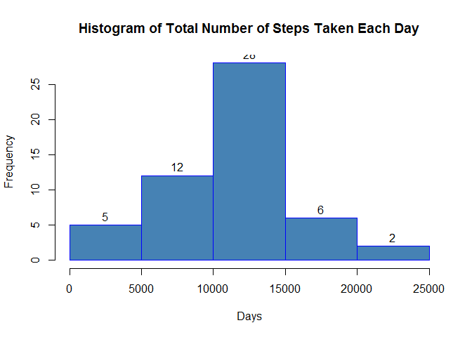
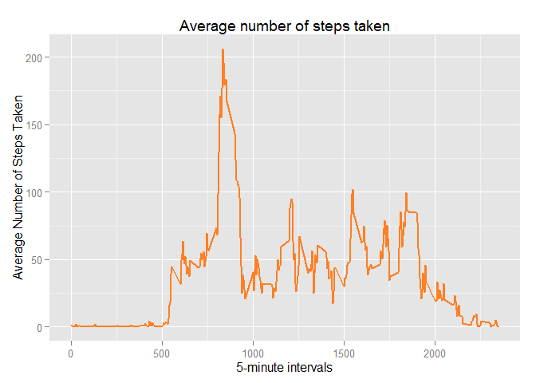
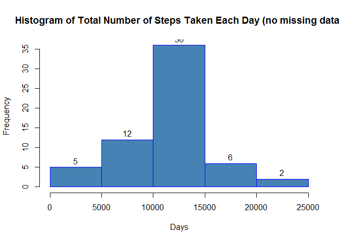

# Reproducible Research: Peer Assessment 1
Carlos Morato  
Saturday, June 13, 2015  

Loading and preprocessing the data
---

```r
unzip(zipfile="activity.zip")
data <- read.csv("activity.csv", colClasses = c("integer", "Date", "factor"))
data$month <- as.numeric(format(data$date, "%m"))
NAfreeData <- na.omit(data)
rownames(NAfreeData) <- 1:nrow(NAfreeData)
head(NAfreeData)
```

```
##   steps       date interval month
## 1     0 2012-10-02        0    10
## 2     0 2012-10-02        5    10
## 3     0 2012-10-02       10    10
## 4     0 2012-10-02       15    10
## 5     0 2012-10-02       20    10
## 6     0 2012-10-02       25    10
```

```r
names(NAfreeData)
```

```
## [1] "steps"    "date"     "interval" "month"
```

```r
dim(NAfreeData)
```

```
## [1] 15264     4
```
What is mean total number of steps taken per day?
---

1. Make a histogram of the total number of steps taken each day

```r
library(ggplot2)
```

```
## Warning: package 'ggplot2' was built under R version 3.1.3
```

```r
TotalSteps <- aggregate(steps ~ date, data = NAfreeData, sum, na.rm = TRUE)

hist(TotalSteps$steps, main = "Histogram of Total Number of Steps Taken Each Day", xlab = "Days", col = "steelblue", border ="blue", labels =TRUE)
```

 

2. Calculate and report the mean and median total number of steps taken per day

```r
mean(TotalSteps$steps)
```

```
## [1] 10766.19
```

```r
median(TotalSteps$steps)
```

```
## [1] 10765
```

What is the average daily activity pattern?
---

1. Make a time series plot (i.e. type = "l") of the 5-minute interval (x-axis) and the average number of steps taken, averaged across all days (y-axis)

```r
avgActivity <- aggregate(NAfreeData$steps, list(interval = as.numeric(as.character(NAfreeData$interval))), FUN = "mean")
names(avgActivity)[2] <- "StepsAvg"

ggplot(avgActivity, aes(interval, StepsAvg)) + geom_line(color = "chocolate1", size = 0.8) + labs(title = "Average number of steps taken", x = "5-minute intervals", y = "Average Number of Steps Taken")
```

 

2. Which 5-minute interval, on average across all the days in the dataset, contains the maximum number of steps?


```r
avgActivity[which.max(avgActivity$StepsAvg), ]
```

```
##     interval StepsAvg
## 104      835 206.1698
```

### Imputing missing values

Note that there are a number of days/intervals where there are missing
values (coded as `NA`). The presence of missing days may introduce
bias into some calculations or summaries of the data.

1. Calculate and report the total number of missing values in the dataset (i.e. the total number of rows with `NA`s)


```r
sum(is.na(data))
```

```
## [1] 2304
```


2. Devise a strategy for filling in all of the missing values in the dataset. The strategy does not need to be sophisticated. For example, you could use the mean/median for that day, or the mean for that 5-minute interval, etc.

mean for that 5-minute interval to fill 
each NA value in the steps column is filled by the mean for that 5-minute interval

3. Create a new dataset that is equal to the original dataset but with the missing data filled in.


```r
newData <- data 
for (i in 1:nrow(newData)) {
    if (is.na(newData$steps[i])) {
        newData$steps[i] <- avgActivity[which(newData$interval[i] == avgActivity$interval), ]$StepsAvg
    }
}
sum(is.na(newData))
```

```
## [1] 0
```

4. Make a histogram of the total number of steps taken each day and Calculate and report the **mean** and **median** total number of steps taken per day. Do these values differ from the estimates from the first part of the assignment? What is the impact of imputing missing data on the estimates of the total daily number of steps?


```r
newTotalSteps <- aggregate(steps ~ date, data = newData, sum, na.rm = TRUE)

hist(newTotalSteps$steps, main = "Histogram of Total Number of Steps Taken Each Day (no missing data)", xlab = "Days", col = "steelblue", border ="blue", labels =TRUE)
```

 

```r
mean(newTotalSteps$steps)
```

```
## [1] 10766.19
```

```r
median(newTotalSteps$steps)
```

```
## [1] 10766.19
```

The new mean that includes missing data is the same that the previous one and the new median is greater than the median that did not include the missing data.


```r
mean(newTotalSteps$steps) - mean(TotalSteps$steps)
```

```
## [1] 0
```

```r
median(newTotalSteps$steps) - median(TotalSteps$steps)
```

```
## [1] 1.188679
```

Are there differences in activity patterns between weekdays and weekends?
---

1. Create a new factor variable in the dataset with two levels -- "weekday" and "weekend" indicating whether a given date is a weekday or weekend day.


```r
newData$weekdays <- factor(format(newData$date, "%A"))
levels(newData$weekdays) <- list(weekday = c("Monday", "Tuesday",
                                             "Wednesday", 
                                             "Thursday", "Friday"),
                                 weekend = c("Saturday", "Sunday"))
table(newData$weekdays)
```

```
## 
## weekday weekend 
##   12960    4608
```


2. Make a panel plot containing a time series plot (i.e. `type = "l"`) of the 5-minute interval (x-axis) and the average number of steps taken, averaged across all weekday days or weekend days (y-axis). The plot should look something like the following, which was created using **simulated data**:


```r
avgSteps <- aggregate(newData$steps, 
                      list(interval = as.numeric(as.character(newData$interval)), 
                           weekdays = newData$weekdays),
                      FUN = "mean")
names(avgSteps)[3] <- "meanOfSteps"
library(lattice)
xyplot(avgSteps$meanOfSteps ~ avgSteps$interval | avgSteps$weekdays, 
       layout = c(1, 2), type = "l", 
       xlab = "Interval", ylab = "Number of steps")
```

 
